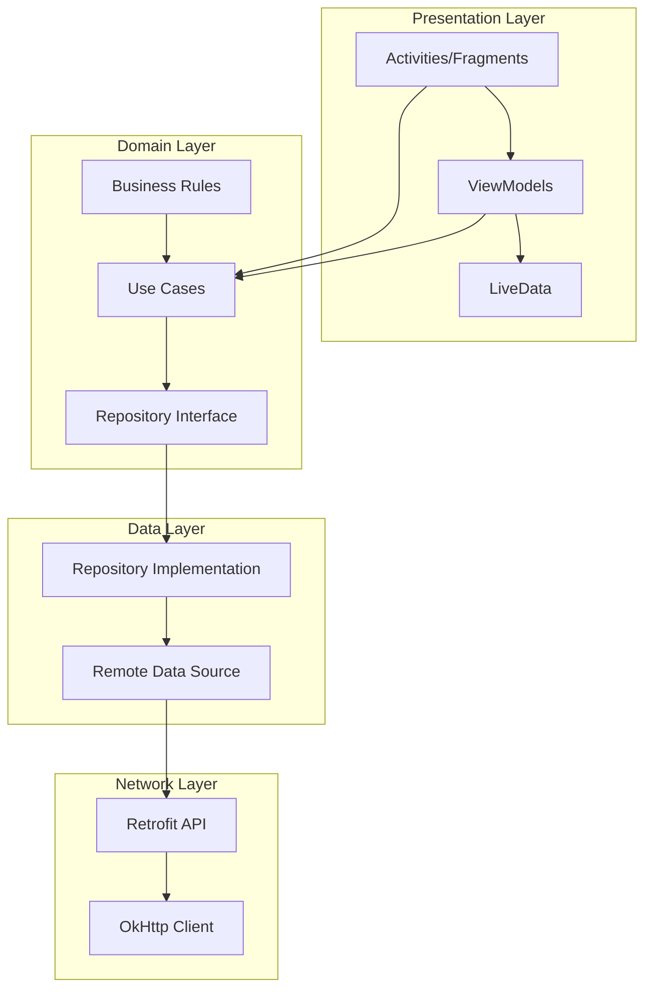

# 📱 Portfolio Holdings Tracker

> **A Professional Android Application showcasing Clean Architecture, MVVM Pattern, and Modern UI/UX Design**

[](https://developer.android.com/)
[](https://kotlinlang.org/)
[](https://developer.android.com/jetpack/guide)
[](https://blog.cleancoder.com/uncle-bob/2012/08/13/the-clean-architecture.html)

## 🎯 Project Overview

This is a sophisticated Android application that demonstrates enterprise-level development practices, featuring a comprehensive portfolio holdings tracker with real-time data visualization, advanced filtering capabilities, and a pixel-perfect user interface designed following Google Material Design guidelines.

### ✨ Key Features

- **📊 Real-time Portfolio Tracking**: Live updates of stock holdings with current market values
- **🔍 Advanced Search & Filter**: Intelligent search by stock symbols with multiple sorting options
- **📈 Comprehensive Analytics**: Detailed P&L calculations including current value, total investment, and daily performance
- **🎨 Dual UI System**: Choose between traditional XML layouts or modern Jetpack Compose UI
- **🎭 Pixel-Perfect UI**: Professional design with smooth animations and responsive layouts
- **🏗️ Clean Architecture**: Multi-module structure following SOLID principles
- **⚡ High Performance**: Optimized for speed with efficient data handling and UI rendering

## 🏛️ Architecture Overview

### Multi-Module Structure

```
📦 SagarPaliwal_Task/
├── 📱 app/                    # Main application module
│   ├── 🎨 UI Layer           # Activities, Fragments, Adapters
│   ├── 🔧 DI Configuration   # Koin dependency injection
│   └── 🎭 ViewModels         # Business logic presentation
├── 🧠 core/                   # Core business logic
│   ├── 📊 Domain Layer       # Use cases and business rules
│   ├── 💾 Data Layer         # Repository implementations
│   └── 🛠️ Utilities          # Either pattern, error handling
└── 🌐 network/               # Network communication
    ├── 🔌 API Services       # Retrofit interfaces
    └── 📡 Data Sources       # Remote data implementations
```

### Clean Architecture Layers



## 🛠️ Technical Stack

### Core Technologies
- **Language**: Kotlin 100%
- **Architecture**: MVVM + Clean Architecture
- **UI Framework**: XML-based layouts with ViewBinding
- **Dependency Injection**: Koin 3.4.3
- **Async Operations**: Kotlin Coroutines

### Networking & Data
- **HTTP Client**: Retrofit 2.9.0
- **JSON Parsing**: Gson 2.10.1
- **Network Interceptor**: OkHttp 4.12.0
- **Error Handling**: Either Pattern (Functional Programming)

### UI/UX Technologies
- **Dual UI System**: XML layouts + Jetpack Compose
- **Layout System**: ConstraintLayout (Performance Optimized)
- **Material Design**: Google Material Components & Material3
- **Animations**: ObjectAnimator, ValueAnimator, AnimatorSet + Compose Animations
- **Custom Drawables**: Vector assets, gradients, shapes
- **Typography**: Custom font families and text styles

### Development Tools
- **Build System**: Gradle 8.8.0
- **Android Gradle Plugin**: 8.8.0
- **Kotlin Version**: 1.9.24
- **Target SDK**: 35 (Android 15)
- **Min SDK**: 24 (Android 7.0)

## 🚀 Getting Started

### Prerequisites
- Android Studio Hedgehog (2023.1.1) or later
- JDK 17 or later
- Android SDK 35
- Git

### Installation

1. **Clone the repository**
   ```bash
   git clone https://github.com/yourusername/SagarPaliwal_Task.git
   cd SagarPaliwal_Task
   ```

2. **Open in Android Studio**
   - Launch Android Studio
   - Select "Open an existing project"
   - Navigate to the cloned directory

3. **Sync Project**
   - Android Studio will automatically sync Gradle files
   - Wait for dependency download to complete

4. **Run the Application**
   - Connect an Android device or start an emulator
   - Click the "Run" button or press `Shift + F10`

### Build Variants
- **Debug**: Development build with logging enabled
- **Release**: Production build with optimizations

## 📱 User Interface

### Design Philosophy
- **Material Design 3**: Following latest Google design guidelines
- **Professional Color Palette**: Carefully selected colors for business applications
- **Responsive Layout**: Optimized for various screen sizes and orientations
- **Accessibility**: WCAG 2.1 AA compliant with proper contrast ratios

### Key Screens

#### 🏠 Main Dashboard
- **Gradient Background**: Professional blue gradient
- **Animated Elements**: Smooth entrance animations
- **Feature Cards**: Highlighting key application capabilities
- **Call-to-Action**: Prominent navigation to holdings

#### 📊 Holdings Screen
- **Top App Bar**: Clean navigation with profile, sort, and search
- **Tab Navigation**: Positions and Holdings with active state indicators
- **Holdings List**: Comprehensive stock information display
- **Portfolio Summary**: Expandable/collapsible financial overview

#### 🔍 Search & Filter
- **Apple-Style Dialog**: Professional search interface
- **Multiple Sort Options**: Name, LTP, Quantity, P&L
- **Real-time Filtering**: Instant search results
- **Clear Functionality**: Easy reset to default view

#### 🎨 Dual UI System
- **XML UI**: Traditional Android layouts with ViewBinding
- **Compose UI**: Modern declarative UI with Material3
- **Seamless Switching**: One-click toggle between UI systems
- **Feature Parity**: Both UIs offer identical functionality
- **Performance Optimized**: Each UI system optimized for its framework

## 🏗️ Architecture Deep Dive

### Dependency Injection with Koin

```kotlin
// Network Module
val networkModule = module {
    single<Retrofit> { /* Retrofit configuration */ }
    single<HoldingsApiService> { get<Retrofit>().create(HoldingsApiService::class.java) }
    single<HoldingsDataSource> { HoldingsDataSourceImpl(get()) }
}

// Repository Module
val repositoryModule = module {
    single<HoldingsRepository> { HoldingsRepositoryImpl(get()) }
}

// Use Case Module
val useCaseModule = module {
    single<GetHoldingsUseCase> { GetHoldingsUseCase(get()) }
}

// ViewModel Module
val viewModelModule = module {
    viewModel<HoldingsViewModel> { HoldingsViewModel(get()) }
}
```

### Error Handling with Either Pattern

```kotlin
sealed class Failure {
    object NetworkConnection : Failure()
    object ServerError : Failure()
    object UnauthorizedError : Failure()
    object UnknownError : Failure()
}

class Either<out L, out R> {
    data class Left<out L>(val value: L) : Either<L, Nothing>()
    data class Right<out R>(val value: R) : Either<Nothing, R>()
    
    fun fold(left: (L) -> Any, right: (R) -> Any): Any = when (this) {
        is Left -> left(value)
        is Right -> right(value)
    }
}
```

### Repository Pattern Implementation

```kotlin
interface HoldingsRepository {
    suspend fun getHoldings(): Either<Failure, HoldingsResponse>
}

class HoldingsRepositoryImpl(
    private val dataSource: HoldingsDataSource
) : HoldingsRepository {
    override suspend fun getHoldings(): Either<Failure, HoldingsResponse> {
        return dataSource.getHoldings()
    }
}
```

## 📊 Performance Optimizations

### UI Performance
- **ConstraintLayout**: Replaced LinearLayout for better performance
- **ViewBinding**: Type-safe view references
- **RecyclerView**: Efficient list rendering with ViewHolder pattern
- **Custom Animations**: Hardware-accelerated animations

### Network Performance
- **OkHttp Interceptors**: Request/response logging
- **Retrofit**: Type-safe HTTP client with automatic JSON parsing
- **Coroutines**: Non-blocking asynchronous operations
- **Error Handling**: Graceful failure management with Either pattern

### Memory Management
- **Lifecycle-aware Components**: Proper cleanup of resources
- **Vector Drawables**: Scalable icons for better performance


## 📈 Future Enhancements

### Planned Features
- **📱 Offline Support**: Local caching with Room database
- **🔔 Push Notifications**: Real-time price alerts
- **📊 Advanced Charts**: Interactive price charts
- **👤 User Authentication**: Secure login with biometric support
- **🌐 Multi-language**: Internationalization support
- **📱 Tablet Support**: Optimized tablet layouts

### Technical Improvements
- **🧪 Comprehensive Testing**: 90%+ code coverage
- **📊 Analytics Integration**: User behavior tracking
- **🔍 Crash Reporting**: Error monitoring
- **⚡ Performance Monitoring**: App performance tracking
- **🔄 CI/CD Pipeline**: Automated testing and deployment

## 🤝 Contributing

We welcome contributions! Please follow these guidelines:

1. **Fork the repository**
2. **Create a feature branch**: `git checkout -b feature/amazing-feature`
3. **Commit changes**: `git commit -m 'Add amazing feature'`
4. **Push to branch**: `git push origin feature/amazing-feature`
5. **Open a Pull Request**

### Code Style
- Follow Kotlin coding conventions
- Use meaningful variable and function names
- Add comprehensive documentation
- Write unit tests for new features

## 👨‍💻 Author

**Sagar Paliwal**
- **Portfolio**: [https://sagar-paliwal.lovable.app/]
- **LinkedIn**: [https://www.linkedin.com/in/sagar-paliwal/]
- **Email**: [sagarpaliwal16@gmail.com]

## 🙏 Acknowledgments

- **Google Material Design** for UI/UX guidelines
- **Android Developer Community** for best practices
- **Kotlin Team** for the amazing language
- **Open Source Contributors** for the libraries used

---

<div align="center">

**⭐ Star this repository if you found it helpful!**

Made with ❤️ and ☕ by Sagar Paliwal

</div>